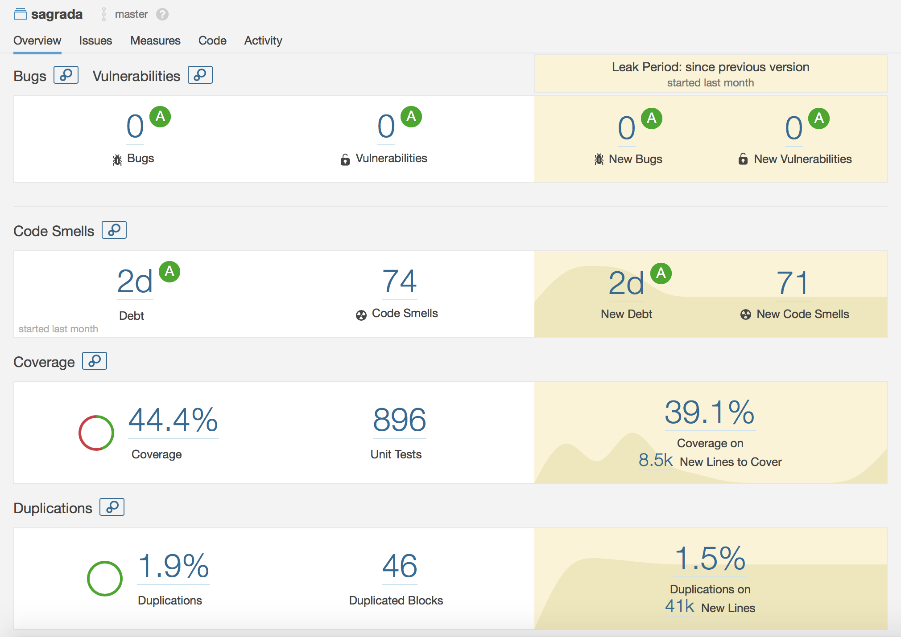
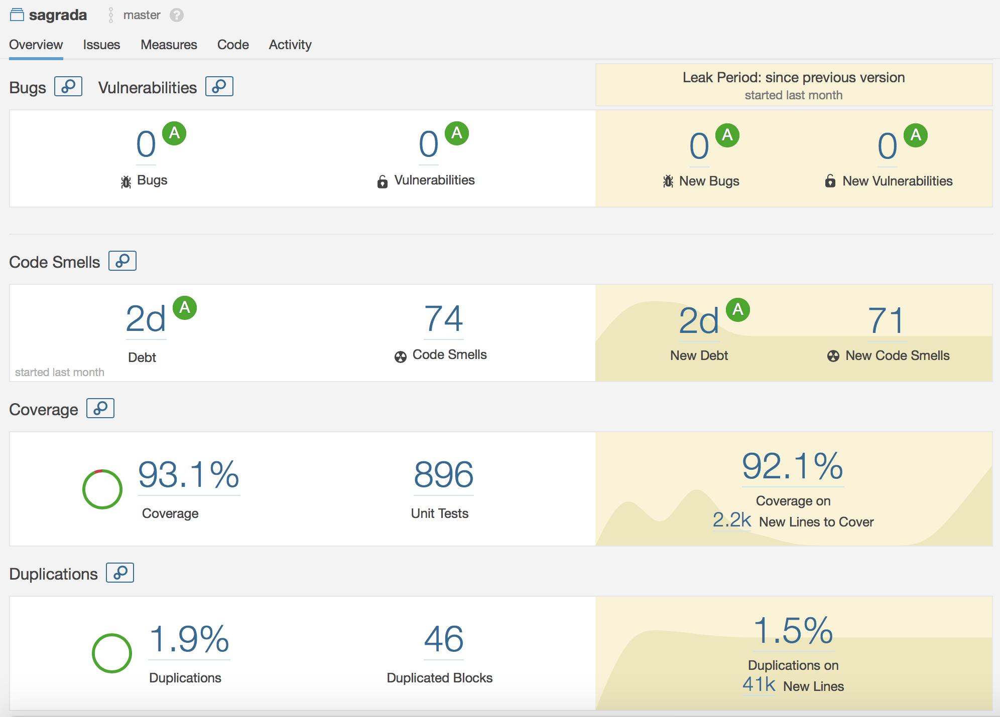

# Progetto di Ingegneria del Software 2018 - Sagrada

## Membri del gruppo

- Poiani Riccardo
    - Matricola: 846379
    - Codice persona: 10533902
- Tibaldi Mattia
    - Matricola: 843840
    - Codice persona: 10521778
- Zhou Tang-tang
    - Matricola: 847685
    - Codice persona: 10540904

## Coverage dei test

## Diagramma UML

Link alla [cartella uml]()

## Funzionalità implementate

- Regole complete
- CLI
- GUI
- RMI
- Socket
- Single Player
- Multi partita

## Spiegazioni aggiuntive

- Limitazione: il progetto sviluppato non consente lo sviluppo di client che non siano scritti in Java, in quanto il 
controller richiede delle interfacce, che risultano essere oggetti concreti lato client serializzabili, come parametri 
di alcuni metodi. Questi oggetti sono principalmente observer del modello, fatta eccezione per le classi view, 
attraverso le quali il server manda semplici stringhe, di errore o di acknowledgement, ai client.   
In ogni caso, lo scambio di questi oggetti è stato limitato alle fasi di connessione, riconessione e "binding" fra gli 
observer e gli oggetti osservati. 

- Per tutta la comunicazione di rete esclusa dal punto precedente, è stato creato un protocollo, basato su JSON, 
per lo scambio di informazioni. 

- Nel progetto la parte riguardante la rete è stata decouplata al meglio delle nostre possibilità dal modello. Al fine
di fare ciò, sono stati creati delle classi (FakeObserver) che contengono al loro interno la gestione delle eccezioni
dovute alla comunicazione. 

- La parte di rete, per quanto riguarda RMI e socket, è stata gestita al piu' possibile in maniera uguale, in modo 
da ricreare lo stesso comportamento e sfruttare la reusability del codice. Per quanto riguarda i socket... (inserire
qui discroso sulla reflection)

- Tutti i messaggi che il server invia ai client vengono inviati all'interno di un thread creato appositamente,
in quanto, se la connessione veniva stabilita con RMI risultava essere bloccante. Tutti i messaggi che il server
invia ai client, di conseguenza, sono stati gestiti in una coda di thread (una per ogni client), con un massimo di un
thread attivo, in modo da assicurare che tutti i messaggi arrivino nel corretto ordine.

- Le tool card sono state realizzate tramite dei comandi, che svolgono micro funzionalità individuate in fase di 
progettazione. La lista di comandi, come il resto delle informazioni riguardanti le carte, vengono caricate da 
file JSON. Nel file riguardanti le carte utensili, la stringa action specifica i vari
commands associati alla tool card che verranno eseguiti. Action è scritta in un linguaggio creato da noi con la seguente
sintassi: [x-nome_comando], dove nome_comando è il nome del comando all'interno di una grammatica (dichiarata nel codice
all'interno del ToolCardLanguageParser)e x è un numero intero positivo che specifica la posizioni di esecuzione del 
comando all'interno di un albero di esecuzione binario. Avere un albero di esecuzione binario consente di distringuere
flussi di esecuzioni a seconda di scelte dell'utente o condizioni di vario tipo.

